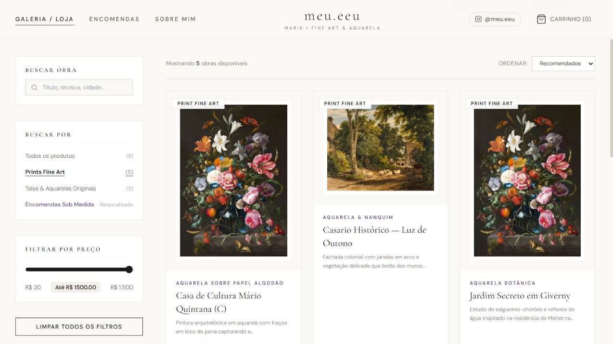
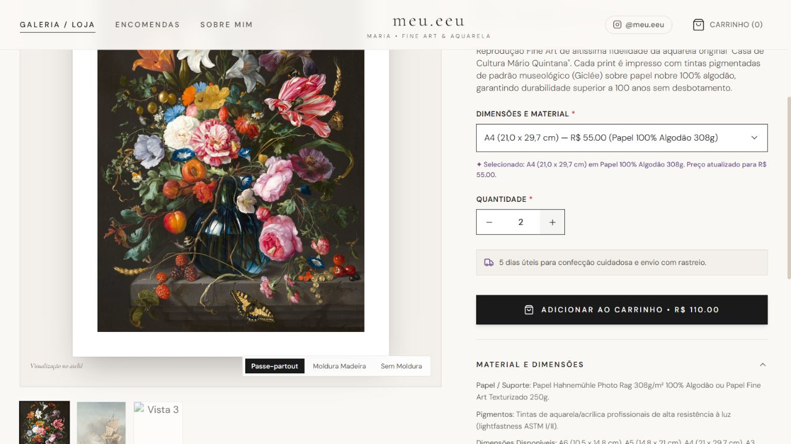
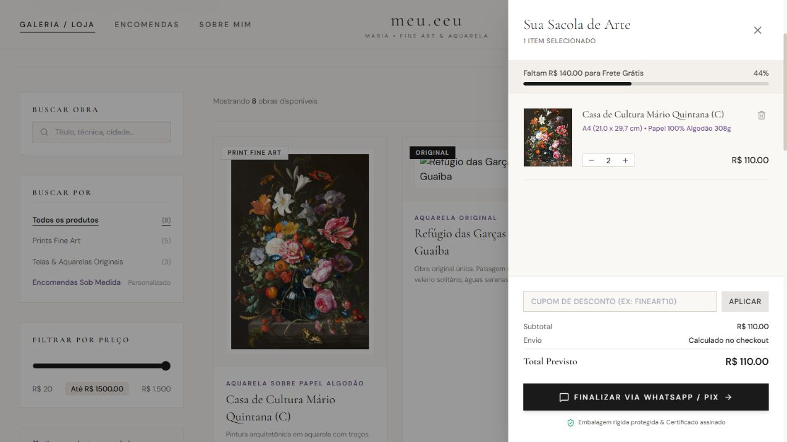

# Meu.Eeu — Galeria digital e loja de arte

Aplicação web em desenvolvimento para apresentar obras de arte, explorar prints e originais e configurar encomendas personalizadas. O projeto reúne um catálogo interativo e um carrinho, com preparação de mensagens de pedido para atendimento pelo WhatsApp.

**Status:** protótipo front-end em desenvolvimento. O catálogo usa dados locais e imagens ilustrativas. O número de WhatsApp é de exemplo e precisa ser substituído antes de usar o site para atendimento real.

## Prévia do projeto

Capturas reais da versão local desta entrega, com imagens ilustrativas.



<details>
<summary>Ver seleção de variante e carrinho</summary>





</details>

## Objetivo

Criar uma experiência de navegação para um ateliê de arte: conhecer a artista, encontrar obras, comparar tamanhos e materiais e organizar uma solicitação de compra ou encomenda.

## Funcionalidades implementadas

- Catálogo com oito obras de exemplo, dividido entre prints e originais.
- Busca por título, técnica e descrição.
- Filtros por categoria e preço máximo; ordenação por preço e nome.
- Detalhes das obras, galeria de imagens e seleção de tamanho/material.
- Atualização do preço conforme a variante e a quantidade selecionadas.
- Carrinho com inclusão, remoção e alteração de quantidades.
- Persistência do carrinho no navegador com `localStorage`.
- Interface de cupom de desconto e indicador de valor para frete grátis.
- Configuração de encomendas em papel e tela, com cálculo do preço-base.
- Preparação de mensagens com os dados do pedido para abrir o WhatsApp.
- Página sobre a artista e navegação com adaptações para celular e computador.

## Tecnologias

| Tecnologia     | Uso                                    |
| -------------- | -------------------------------------- |
| React 19       | Componentes e interfaces               |
| TypeScript 5   | Tipos para obras, variantes e carrinho |
| Context API    | Compartilhamento do estado do carrinho |
| Tailwind CSS 3 | Estilos e adaptações de layout         |
| Next.js 16     | Rotas, renderização e build            |
| ESLint 9       | Regras de qualidade                    |
| Prettier       | Formatação consistente                 |
| Husky          | Verificação dos arquivos staged        |
| Lucide React   | Ícones                                 |

## Executar no computador

Requisitos: Node.js 20.9 ou superior e npm. O arquivo `.nvmrc` indica Node.js 22.

Na pasta do projeto:

```powershell
npm.cmd ci
npm.cmd run dev
```

Abra `http://localhost:3000`. Para encerrar, pressione `Ctrl+C`.

Os comandos acima usam `npm.cmd` para funcionar também no PowerShell com restrições a scripts. Em outros terminais, use `npm`.

### Gerar e conferir a versão final

```powershell
npm.cmd run build
npm.cmd run start
```

O build de produção é iniciado pelo comando `start`, na porta 3000. `.next/`, `node_modules/` e `out/` são geradas localmente e estão fora do versionamento.

### Verificações de código

```powershell
npm.cmd run lint
npm.cmd run typecheck
npm.cmd run format:check
```

O pre-commit do Husky executa ESLint e Prettier nos arquivos staged.

## Organização do código

```text
meu-eeu-github/
├── app/
│   ├── encomendas/page.tsx
│   ├── obras/[slug]/page.tsx
│   ├── sobre/page.tsx
│   ├── layout.tsx
│   └── page.tsx
├── docs/
│   ├── GUIA_GITHUB.md          # Publicação e atualizações do repositório
│   └── PROGRESSO.md            # Entregas, limites e roteiro de demonstração
├── src/
│   ├── components/            # Catálogo, obras, encomendas, carrinho e navegação
│   ├── context/CartContext.tsx
│   ├── data/artworks.ts       # Obras, variantes, preços e conteúdo de exemplo
│   └── types.ts               # Tipos das obras e do carrinho
├── .gitignore
├── eslint.config.mjs
├── next.config.ts
├── package.json
├── package-lock.json
├── postcss.config.js
├── tailwind.config.js
└── tsconfig.json
```

## Como personalizar

- **Obras e preços:** edite `src/data/artworks.ts`.
- **Contato pelo WhatsApp:** substitua `5551999999999` em `src/components/CartDrawer.tsx` e `src/components/CommissionsPage.tsx`, usando país, DDD e telefone, somente com números.
- **Apresentação da artista:** edite `src/components/AboutPage.tsx`.
- **Instagram e e-mail:** confira `Navbar.tsx`, `Footer.tsx` e `AboutPage.tsx`.
- **Cores e fontes:** confira `tailwind.config.js` e `app/globals.css`.

## Estágio atual e próximos passos

O projeto demonstra a interface e os fluxos locais. Ainda não há servidor, banco de dados, painel administrativo, cálculo real de frete ou processamento de pagamento. Abrir uma mensagem no WhatsApp não confirma o envio nem registra um pedido.

As fotos externas são ilustrativas e não comprovam autoria das obras. O conteúdo de Instagram é uma simulação local; não existe integração com a API do Instagram. Fontes e imagens dependem de serviços externos.

Na verificação desta entrega, uma imagem externa do catálogo não carregou. A interface de cadastro de novidades também não possui serviço de inscrição conectado.

Prioridades sugeridas para a evolução:

1. Substituir dados, imagens e contatos de exemplo pelo conteúdo definitivo.
2. Validar filtros, preços, cupom, carrinho e formulários em diferentes dispositivos.
3. Revisar acessibilidade e o texto das confirmações de pedido.
4. Publicar uma demonstração e anexar capturas de tela ao repositório.
5. Avaliar serviços de pagamento e gestão de pedidos conforme a necessidade do ateliê.

### Verificação desta entrega

- Build de produção concluído com sucesso usando as dependências já instaladas no ambiente de trabalho.
- Conferidos no navegador: busca sem resultados, filtro de prints, seleção A4 com duas unidades (R$ 55 por unidade e R$ 110 no total), inclusão no carrinho e preservação dos itens após recarregar a página.
- Esta verificação não cobre todos os fluxos nem substitui a revisão dos itens registrados em [Progresso](docs/PROGRESSO.md).

## Documentação e apresentação profissional

- [Guia para publicar e atualizar no GitHub](docs/GUIA_GITHUB.md)
- [Registro de progresso e roteiro de demonstração](docs/PROGRESSO.md)

**Descrição curta para o GitHub:**

> Galeria digital e loja de arte em desenvolvimento, com React, Tailwind CSS, catálogo interativo, carrinho persistente e configuração de encomendas.

**Texto-base para a seção Projetos do LinkedIn:**

> Desenvolvimento de uma galeria digital e loja de arte com React, TypeScript, Next.js e Tailwind CSS. O projeto conta com catálogo pesquisável, páginas individuais para obras, filtros por categoria e preço, seleção de variantes, carrinho persistente e interface para encomendas personalizadas. Em andamento, com foco na evolução da experiência de navegação e na validação dos fluxos de compra e atendimento.

## Créditos e licença

Projeto organizado para o portfólio de Luís Gabriel Araújo do Nascimento a partir do código existente do Meu.Eeu. A apresentação da marca/artista e as imagens de exemplo devem ser conferidas antes do uso comercial.

Não foi definida uma licença de distribuição para o código deste projeto. As bibliotecas, fontes e imagens utilizadas mantêm suas respectivas licenças e condições de uso.
